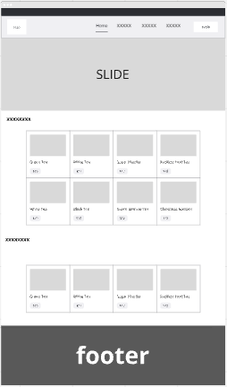
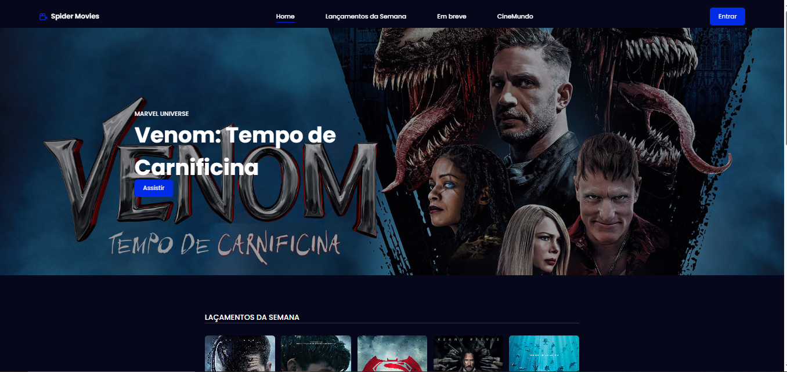
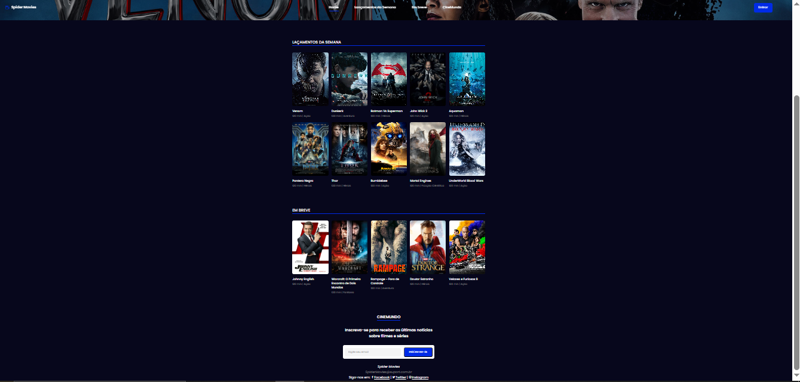

# Trabalho Prático - Semana 03

Dessa vez, vamos escolher uma proposta de projeto para trabalhar. Na [lista de propostas de projetos](propostas-projetos.md), escolha um dentre as alternativas.

Nessa atividade, você deverá montar a página inicial do projeto escolhido, a organização do HTML aplicando semântica correta e uso aprimorado do CSS. Leia o enunciado completo no Canvas para mais detalhes.

**IMPORTANTE:** Você deve trabalhar e alterar apenas arquivos dentro da pasta **`public`**. Deixe todos os demais arquivos e pastas desse repositório inalterados. **PRESTE MUITA ATENÇÃO NISSO.**

## Informações Gerais

- Nome:Carolina Eller Marinho de Paula
- Matricula:878827
- Proposta de projeto escolhida:Catalago de filmes
- Breve descrição sobre seu projeto:catálogo de filmes é uma aplicação que permite aos usuários explorar, pesquisar e gerenciar uma coleção de filmes. Através de uma interface intuitiva, os usuários podem visualizar informações detalhadas sobre cada filme, como título, sinopse, elenco, gênero e ano de lançamento. Além disso, o catálogo pode incluir funcionalidades como a possibilidade de adicionar filmes à lista de favoritos, classificar e comentar sobre os filmes assistidos, e até mesmo filtrar por categorias específicas.

## Print do esboço criada

<<  COLOQUE A IMAGEM AQUI >>

## Print da home-page criada

<<  COLOQUE A IMAGEM AQUI >>

